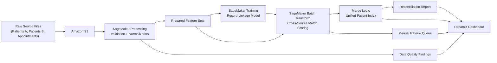

# Self-Healing Data Pipeline with AI Reconciliation

This project simulates a real enterprise data engineering problem: fragmented patient records across multiple systems, inconsistent schemas, duplicate identities, and broken downstream joins.

The goal is to build a reconciliation pipeline that can:

- detect schema mismatches across sources
- identify duplicate records
- flag broken joins in downstream appointment data
- match likely records across systems
- merge high-confidence matches into a unified patient index
- generate a reconciliation report and manual review queue

## Problem

In real organizations, patient or customer data rarely lives in one clean system. Instead, records are spread across operational systems, CRM tools, vendor exports, and downstream reporting tables.

That leads to problems like:

- duplicate identities
- inconsistent field names
- missing contact fields
- formatting mismatches across systems
- orphaned foreign keys in downstream datasets

This project models that problem and shows how an AI-assisted reconciliation workflow can improve data quality.

## Dataset Strategy

The project uses the Kaggle Medical Appointment No Shows dataset as the real-world backbone:

- base file: `data/raw/master_appointments.csv`

From that base dataset, a derived patient master and two simulated source systems were created:

- `data/raw/master_patients.csv`
- `data/raw/patients_source_a.csv`
- `data/raw/patients_source_b.csv`
- `data/raw/appointments.csv`

The derived files intentionally include realistic data quality issues:

- duplicate patient records
- different schemas between source systems
- missing emails and postal codes
- phone formatting inconsistencies
- name and address variations
- blank and orphan patient references in appointments

## Implementation

Implemented modules:

- `src/validate.py`
- `src/features.py`
- `src/match.py`
- `src/merge.py`
- `src/report.py`
- `src/pipeline.py`
- `app/app.py`

## Pipeline Flow

### 1. Validation

`src/validate.py` checks:

- row counts by dataset
- schema mismatches
- null counts
- duplicate records in source A and source B
- broken joins from appointments to patient records

### 2. Feature Preparation

`src/features.py` standardizes fields so records can be compared reliably:

- normalized names
- normalized emails
- normalized phones
- normalized addresses
- aligned DOB fields

### 3. Record Matching

`src/match.py` performs cross-source candidate matching.

It uses:

- blocking on DOB, phone, or email
- weighted scoring using:
  - name similarity
  - address similarity
  - exact email match
  - exact phone match
  - exact DOB match

Each candidate pair is classified as:

- `auto_match`
- `review`
- `no_match`

### 4. Merge

`src/merge.py` creates a unified patient index from high-confidence matches and writes uncertain records to a manual review queue.

Generated outputs:

- `data/processed/unified_patients.csv`
- `data/processed/manual_review.csv`

### 5. Reporting

`src/report.py` creates the reconciliation summary artifact:

- `data/processed/reconciliation_report.json`

## Results

Current reconciliation metrics:

- Source A rows: `1220`
- Source B rows: `1242`
- Appointment rows: `2913`
- Auto-matched records: `1073`
- Review records: `147`
- Unified patients created: `1056`
- Manual review queue: `147`

Data quality findings captured in validation:

- missing emails in source B
- missing postal codes in source B
- duplicate rows in both source systems
- blank patient references in appointments
- orphan patient references in appointments

## Project Structure

```text
self-healing-data-pipeline/
  data/
    raw/
    processed/
  notebooks/
  src/
    features.py
    match.py
    merge.py
    report.py
    validate.py
  app/
  README.md
  requirements.txt
```

## How To Run

From the project root:

```bash
python3 -m venv .venv
source .venv/bin/activate
pip install -r requirements.txt
python src/pipeline.py
```

## Output Files

Generated artifacts:

- `data/processed/match_candidates.csv`
- `data/processed/unified_patients.csv`
- `data/processed/manual_review.csv`
- `data/processed/reconciliation_report.json`

## How To Demo

Run the full reconciliation pipeline:

```bash
python src/pipeline.py
```

Launch the Streamlit dashboard:

```bash
streamlit run app/app.py
```

What to show in the demo:

- top-level reconciliation metrics
- data quality findings across source systems
- auto-matched patient records
- manual review queue for uncertain matches
- unified patient index generated from high-confidence matches

## SageMaker Direction

The local MVP is designed to map into Amazon SageMaker in the next phase:

- `SageMaker Processing` for validation and normalization
- `SageMaker Training` for record linkage model training
- `Batch Transform` for scoring new incoming records
- `SageMaker Experiments` for comparing matching strategies

## SageMaker Architecture

### Current Local Workflow

The current implementation runs locally as a modular pipeline:

- `validate.py` profiles source data and identifies quality issues
- `features.py` standardizes comparable identity fields
- `match.py` generates candidate matches and assigns confidence scores
- `merge.py` creates a unified patient index from high-confidence matches
- `report.py` produces a reconciliation summary and manual review queue
- `pipeline.py` orchestrates the full flow end to end

### Target SageMaker Workflow

The same workflow can be deployed in Amazon SageMaker as a batch-oriented reconciliation system:

1. Raw source extracts are stored in Amazon S3
2. `SageMaker Processing` runs validation and normalization scripts
3. A record linkage model is trained in `SageMaker Training`
4. `SageMaker Batch Transform` scores incoming cross-source record pairs
5. Merge logic produces unified records and a manual review queue
6. Output datasets and reconciliation reports are written back to S3
7. `SageMaker Experiments` tracks model versions and matching strategy comparisons

### Why SageMaker

SageMaker fits this project because it supports the exact parts of the reconciliation workflow that need to scale:

- large-batch preprocessing for messy source system exports
- repeatable model training for entity resolution
- batch inference for new record reconciliation runs
- experiment tracking to compare matching thresholds and model performance

This makes the project feel like a real internal data platform workflow instead of a notebook-only demo.

### Cost-Control Strategy

The project is intentionally designed around batch jobs instead of always-on infrastructure.

Cost-conscious choices:

- use `SageMaker Processing` only when running a reconciliation job
- use `SageMaker Batch Transform` instead of a persistent real-time endpoint
- store inputs and outputs in S3 rather than keeping compute running
- stop all notebook resources when not in use
- compare experiments selectively to avoid unnecessary training runs

### Architecture Diagram



## Resume Framing

Built an AI-driven data reconciliation pipeline that detected duplicate records, schema mismatches, and broken joins across fragmented healthcare datasets, then matched and merged cross-source patient identities into a unified master index with manual review reporting.
